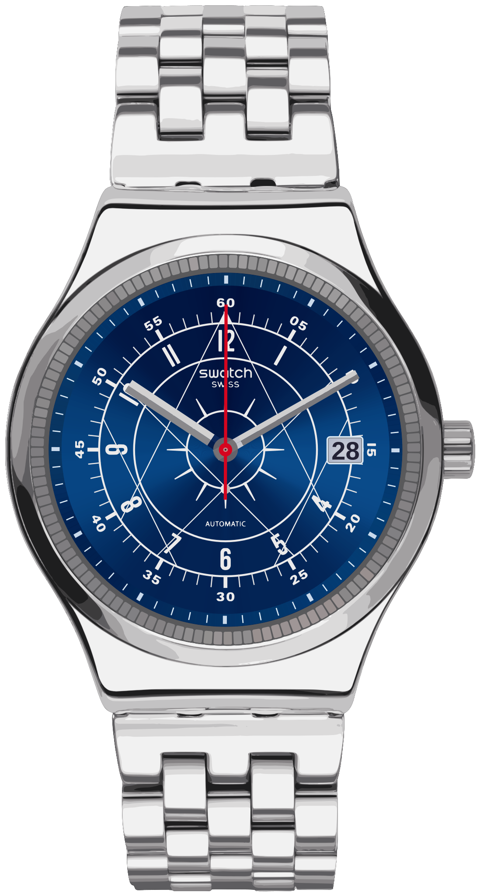

# SISTEM BOREAL YIS401GC — visual study

A one-page site that rebuilds the Swatch SISTEM BOREAL YIS401GC in code. The watch is **no longer hand-drawn**: it is extracted from the
official product photo by an edge-detection pipeline (`pipeline/`, explained in [`PIPELINE.md`](PIPELINE.md)) and drawn from the measured data.

Unofficial fan study, not affiliated with Swatch. The raw photos are not in the repository and are never served; only code and the
numeric / vector output are.

## Run
Open `index.html`, or serve the folder:

    python -m http.server 8765

No build step for the site. Fonts (Poppins, Barlow Condensed, IBM Plex Mono, Vazirmatn) load from Google Fonts with fallbacks.

To regenerate the data from the photo (see `PIPELINE.md`, stage 0):

    pip install -r pipeline/requirements.txt
    python pipeline/run_all.py

## What is on the page
- Live watch rebuilt from the photo: traced case, lugs, crown and bracelet; 120-tooth fluted bezel; the dial's three rings, two rows of 60 ticks,
  12 rays, six chords + apex triangle, 25 traced numerals / labels / logo, the date window; faceted steel hands whose facets follow the light (silver to near-black).
- Light lab: slider turns the light (dial lobes measured from the photo, bezel highlights, gloss).
- Geometry lab: toggle rings, chords, rays, numerals, minute track, logo/date, hands.
- Palette: measured HEX values, click to copy.
- Anatomy and Movement: scroll-driven exploded view and caseback flip.
- **Edge lab**: the 13 pipeline stages, each drawn from its own output with its measured numbers.
- Specs table (official vs retailer-listing vs photo), FA (RTL) / EN toggle, reduced-motion support.

## Layout
    index.html  style.css  main.js     the site
    assets/boreal-data.js              dial, hands, bezel, shading (generated)
    assets/boreal-body.js              traced case / bracelet tonal layers (generated)
    assets/boreal-back.js              traced caseback: body tones + movement colour classes (generated, lazy-loaded, ~1 MB)
    assets/boreal-pipeline.js          stage texts + numbers for the Edge lab (generated)
    assets/boreal-preview.svg          the whole watch as one static SVG (generated)
    pipeline/                          the Python pipeline (stages s01…s12, run_all.py)
    pipeline/out/*.json                numeric outputs of every stage (rasters are git-ignored)
